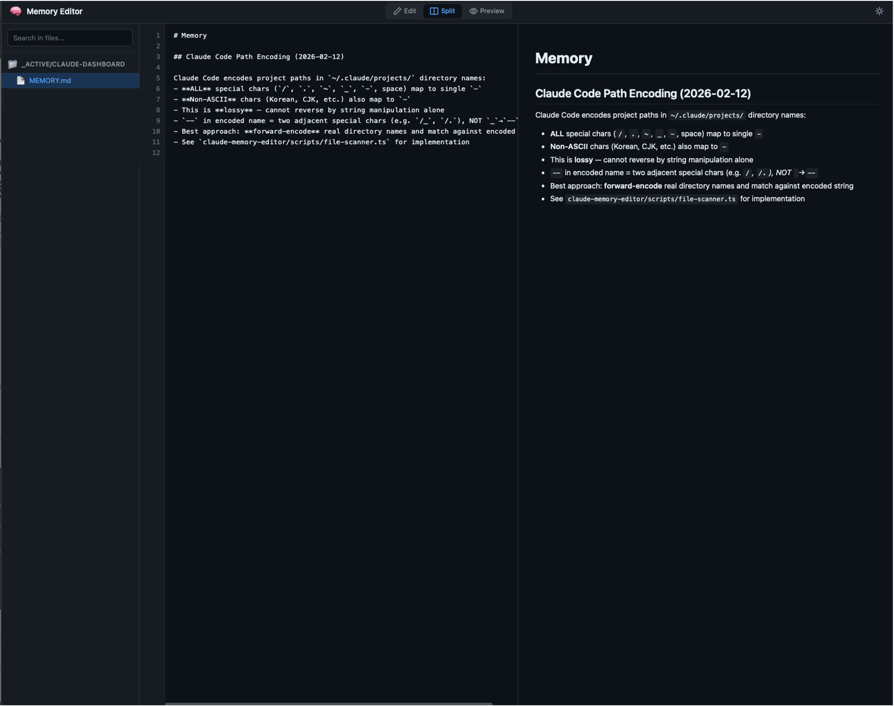

# claude-memory-editor


Web-based markdown editor for Claude Code auto memory files.

## Demo



## Installation

**Requirements:** Claude Code / Node.js 18+

### From Plugin Marketplace

```
/plugin marketplace add uppinote20/claude-memory-editor
/plugin install claude-memory-editor
```

### Manual Installation

```bash
git clone https://github.com/uppinote20/claude-memory-editor.git ~/.claude/plugins/claude-memory-editor
```

## Features

- **Split view** - Edit / Split / Preview modes
- **File tree sidebar** - Project grouping with collapsible folders
- **Search** - Search across all memory files
- **Auto-save** - 2 second debounce, automatic saving
- **Dark/Light theme** - Follows system preference
- **Line numbers** - Toggle on/off
- **Keyboard shortcuts** - Ctrl+S save, Tab indent

## Commands

### `/claude-memory-editor:open`

Opens the memory editor in your browser.

## Security

- Server binds to `127.0.0.1` only (localhost)
- Path validation: reads only under `~/.claude/`
- Write validation: only `~/.claude/projects/*/memory/*.md`
- HTML sanitization on all markdown preview output

## Development

```bash
npm install && npm run build
```

See [CONTRIBUTING.md](CONTRIBUTING.md) for details.

## Star History

[](https://star-history.com/#uppinote20/claude-memory-editor&Date)

## License

MIT
